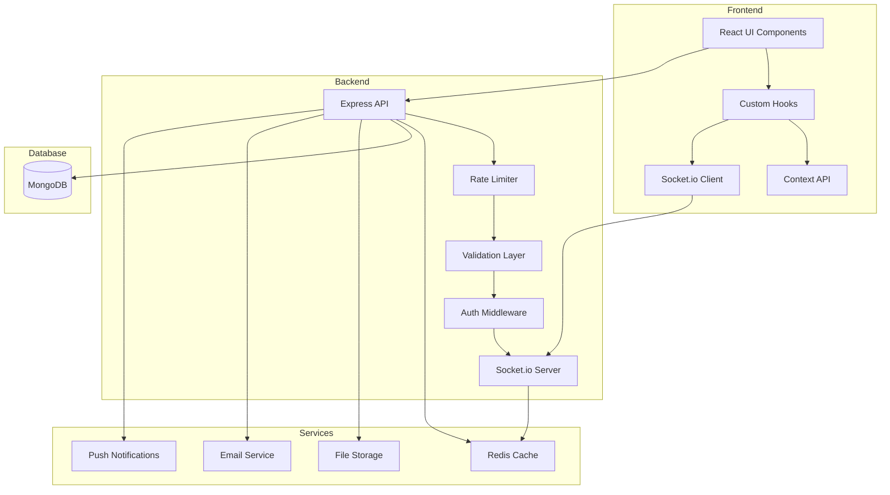

# WhatsApp Lite - Comprehensive Improvement Plan

## Executive Summary

This document outlines a comprehensive improvement plan for the WhatsApp Lite application, covering security enhancements, performance optimizations, new features, testing infrastructure, and deployment strategies. The plan is organized into phases for systematic implementation.

---

## Current State Analysis

### Strengths
- ✅ Real-time messaging with Socket.io
- ✅ Voice & video calls via WebRTC
- ✅ Group chat functionality
- ✅ File sharing capabilities
- ✅ User authentication with JWT
- ✅ Privacy settings and blocking
- ✅ Message reactions and editing (schema ready)
- ✅ Broadcast lists
- ✅ Scheduled messages

### Areas for Improvement
- 🔴 Large monolithic files (server.js ~88KB, App.js ~234KB)
- 🔴 No rate limiting or CSRF protection
- 🔴 Limited test coverage
- 🔴 No input validation middleware
- 🔴 Missing error handling middleware
- 🔴 No message pagination
- 🔴 Missing end-to-end encryption
- 🔴 No push notifications
- 🔴 Limited accessibility features

---

## Phase 1: Security Enhancements

### 1.1 Authentication & Authorization

#### JWT Improvements
- [ ] Implement refresh token rotation
- [ ] Add token blacklisting for logout
- [ ] Set shorter access token expiration (15-30 minutes)
- [ ] Store refresh tokens in HTTP-only cookies
- [ ] Implement token revocation mechanism

#### Password Security
- [ ] Enforce strong password policies (min length, complexity)
- [ ] Implement password strength indicator on frontend
- [ ] Add account lockout after failed login attempts
- [ ] Implement two-factor authentication (2FA) via TOTP

#### Session Management
- [ ] Track active sessions per user
- [ ] Allow users to view and revoke active sessions
- [ ] Implement device fingerprinting
- [ ] Add login notifications for new devices

### 1.2 API Security

#### Rate Limiting
- [ ] Implement express-rate-limit for all endpoints
- [ ] Configure stricter limits for authentication endpoints
- [ ] Add IP-based blocking for suspicious activity
- [ ] Implement sliding window rate limiting

```javascript
// Example implementation
const rateLimit = require('express-rate-limit');

const authLimiter = rateLimit({
  windowMs: 15 * 60 * 1000, // 15 minutes
  max: 5, // 5 attempts per window
  message: 'Too many login attempts, please try again later'
});

const apiLimiter = rateLimit({
  windowMs: 60 * 1000, // 1 minute
  max: 100, // 100 requests per minute
});
```

#### CSRF Protection
- [ ] Implement csurf middleware
- [ ] Generate CSRF tokens for state-changing operations
- [ ] Validate tokens on all POST/PUT/DELETE requests

#### Input Validation
- [ ] Implement express-validator or Joi
- [ ] Create validation schemas for all endpoints
- [ ] Sanitize user inputs to prevent XSS
- [ ] Validate file uploads (type, size, content)

```javascript
// Example validation schema
const { body, validationResult } = require('express-validator');

const registerValidation = [
  body('username')
    .isLength({ min: 3, max: 30 })
    .isAlphanumeric()
    .withMessage('Username must be 3-30 alphanumeric characters'),
  body('password')
    .isLength({ min: 8 })
    .matches(/^(?=.*\d)(?=.*[a-z])(?=.*[A-Z])(?=.*[^a-zA-Z0-9])/)
    .withMessage('Password must contain uppercase, lowercase, number, and special character'),
  body('email')
    .isEmail()
    .normalizeEmail()
];
```

#### Security Headers
- [ ] Implement Helmet.js for security headers
- [ ] Configure Content Security Policy (CSP)
- [ ] Enable HSTS for HTTPS enforcement
- [ ] Configure X-Frame-Options, X-XSS-Protection

### 1.3 Data Security

#### Encryption
- [ ] Implement end-to-end encryption for messages
- [ ] Encrypt sensitive data at rest (phone, email)
- [ ] Use environment variables for all secrets
- [ ] Implement secure key management

#### Data Validation
- [ ] Validate MongoDB ObjectIds
- [ ] Implement query sanitization to prevent NoSQL injection
- [ ] Add file content validation (magic numbers)
- [ ] Implement virus scanning for uploads

---

## Phase 2: Performance Optimizations

### 2.1 Backend Performance

#### Database Optimization
- [ ] Add compound indexes for frequent queries
- [ ] Implement message pagination with cursor-based approach
- [ ] Add database connection pooling optimization
- [ ] Implement query result caching

```javascript
// Example indexes
messageSchema.index({ fromUsername: 1, toUsername: 1, timestamp: -1 });
messageSchema.index({ toUsername: 1, timestamp: -1 });
groupMessageSchema.index({ groupId: 1, timestamp: -1 });
```

#### Caching Layer
- [ ] Implement Redis for session storage
- [ ] Cache user online status
- [ ] Cache frequently accessed user profiles
- [ ] Implement message delivery status caching

#### API Optimization
- [ ] Implement response compression (gzip/brotli)
- [ ] Add API response caching headers
- [ ] Implement request batching for bulk operations
- [ ] Optimize Socket.io event handling

### 2.2 Frontend Performance

#### Code Splitting
- [ ] Split App.js into smaller components
- [ ] Implement lazy loading for routes
- [ ] Create separate bundles for different features
- [ ] Implement dynamic imports for heavy components

```javascript
// Example component structure
// src/components/
// ├── auth/
// │   ├── Login.js
// │   ├── Register.js
// │   └── ForgotPassword.js
// ├── chat/
// │   ├── ChatList.js
// │   ├── ChatWindow.js
// │   ├── MessageInput.js
// │   └── MessageBubble.js
// ├── call/
// │   ├── VideoCall.js
// │   ├── VoiceCall.js
// │   └── CallHistory.js
// └── settings/
//     ├── ProfileSettings.js
//     ├── PrivacySettings.js
//     └── NotificationSettings.js
```

#### Message Loading
- [ ] Implement infinite scroll for messages
- [ ] Load messages in chunks (50-100 at a time)
- [ ] Implement virtual scrolling for large chat lists
- [ ] Add message loading skeletons

#### Asset Optimization
- [ ] Implement image lazy loading
- [ ] Add image compression before upload
- [ ] Use WebP format for images
- [ ] Implement progressive image loading

---

## Phase 3: New Features

### 3.1 Message Enhancements

#### Message Reactions (UI Implementation)
- [ ] Add reaction picker UI component
- [ ] Display reactions on messages
- [ ] Implement reaction aggregation
- [ ] Add reaction notifications

#### Message Threading
- [ ] Implement reply threading UI
- [ ] Show thread previews
- [ ] Add thread navigation
- [ ] Implement thread notifications

#### Voice Message Improvements
- [ ] Add waveform visualization
- [ ] Implement pause/resume recording
- [ ] Add playback speed control
- [ ] Implement background playback

### 3.2 User Experience

#### Typing Indicators Enhancement
- [ ] Show typing indicator in group chats (who is typing)
- [ ] Add "recording voice message" indicator
- [ ] Implement "uploading file" progress indicator

#### Read Receipts Enhancement
- [ ] Show read by list in group chats
- [ ] Add delivered/read timestamps
- [ ] Implement per-message read receipt toggle

#### Search Functionality
- [ ] Implement full-text message search
- [ ] Add advanced search filters (date, type, sender)
- [ ] Implement search within chat
- [ ] Add global search across all chats

### 3.3 Notifications

#### Push Notifications
- [ ] Implement Web Push API
- [ ] Add push notification for new messages
- [ ] Implement notification for calls
- [ ] Add notification preferences per chat

#### In-App Notifications
- [ ] Implement notification center
- [ ] Add notification badges
- [ ] Implement do-not-disturb mode
- [ ] Add notification sound preferences

### 3.4 Additional Features

#### Message Forwarding
- [ ] Implement message forwarding UI
- [ ] Add forward to multiple chats
- [ ] Show forwarded message indicator
- [ ] Implement forward limit (5 chats like WhatsApp)

#### QR Code
- [ ] Generate QR code for profile sharing
- [ ] Implement QR code scanner
- [ ] Add contact addition via QR
- [ ] Generate group invite QR codes

#### Status/Stories Feature
- [ ] Implement status creation (text, image, video)
- [ ] Add status viewing functionality
- [ ] Implement status privacy settings
- [ ] Add status reactions and replies

---

## Phase 4: Testing Infrastructure

### 4.1 Backend Testing

#### Unit Tests
- [ ] Set up Jest testing framework
- [ ] Write tests for utility functions
- [ ] Test middleware functions
- [ ] Test authentication logic

#### Integration Tests
- [ ] Test API endpoints with supertest
- [ ] Test Socket.io events
- [ ] Test database operations
- [ ] Test file upload handling

```javascript
// Example test structure
describe('Authentication API', () => {
  describe('POST /api/register', () => {
    it('should register a new user with valid credentials', async () => {
      const res = await request(app)
        .post('/api/register')
        .send({ username: 'testuser', password: 'Test@123' });
      expect(res.statusCode).toEqual(201);
    });

    it('should reject duplicate usernames', async () => {
      // Test implementation
    });
  });
});
```

### 4.2 Frontend Testing

#### Component Tests
- [ ] Set up React Testing Library
- [ ] Test individual components
- [ ] Test component interactions
- [ ] Test form validations

#### E2E Tests
- [ ] Set up Cypress or Playwright
- [ ] Test user registration flow
- [ ] Test messaging flow
- [ ] Test call functionality

### 4.3 Test Coverage Goals
- [ ] Achieve 80%+ code coverage for backend
- [ ] Achieve 70%+ code coverage for frontend
- [ ] Set up coverage reporting
- [ ] Add pre-commit hooks for test execution

---

## Phase 5: Code Quality & Architecture

### 5.1 Backend Refactoring

#### Project Structure
```
backend/
├── src/
│   ├── config/
│   │   ├── database.js
│   │   ├── passport.js
│   │   └── socket.js
│   ├── controllers/
│   │   ├── authController.js
│   │   ├── messageController.js
│   │   ├── groupController.js
│   │   └── callController.js
│   ├── middleware/
│   │   ├── auth.js
│   │   ├── validation.js
│   │   ├── rateLimit.js
│   │   └── errorHandler.js
│   ├── models/
│   │   ├── User.js
│   │   ├── Message.js
│   │   └── Group.js
│   ├── routes/
│   │   ├── auth.js
│   │   ├── messages.js
│   │   ├── groups.js
│   │   └── calls.js
│   ├── services/
│   │   ├── emailService.js
│   │   ├── pushService.js
│   │   └── storageService.js
│   ├── utils/
│   │   ├── validators.js
│   │   ├── helpers.js
│   │   └── constants.js
│   └── app.js
├── tests/
├── uploads/
└── package.json
```

#### Code Improvements
- [ ] Implement proper error handling middleware
- [ ] Create custom error classes
- [ ] Implement async/await error wrapper
- [ ] Add request logging with Morgan

### 5.2 Frontend Refactoring

#### Project Structure
```
frontend/
├── src/
│   ├── components/
│   │   ├── common/
│   │   │   ├── Button.js
│   │   │   ├── Input.js
│   │   │   ├── Modal.js
│   │   │   └── Avatar.js
│   │   ├── auth/
│   │   ├── chat/
│   │   ├── call/
│   │   └── settings/
│   ├── hooks/
│   │   ├── useAuth.js
│   │   ├── useSocket.js
│   │   ├── useChat.js
│   │   └── useCall.js
│   ├── context/
│   │   ├── AuthContext.js
│   │   ├── ChatContext.js
│   │   └── ThemeContext.js
│   ├── services/
│   │   ├── api.js
│   │   └── socket.js
│   ├── utils/
│   │   ├── formatters.js
│   │   ├── validators.js
│   │   └── constants.js
│   ├── styles/
│   │   └── index.css
│   └── App.js
├── public/
└── package.json
```

#### State Management
- [ ] Implement Context API or Redux for global state
- [ ] Create custom hooks for reusable logic
- [ ] Implement proper state persistence
- [ ] Add state debugging tools

---

## Phase 6: Accessibility & UX

### 6.1 Accessibility (a11y)

#### WCAG Compliance
- [ ] Add proper ARIA labels
- [ ] Implement keyboard navigation
- [ ] Add focus indicators
- [ ] Ensure color contrast compliance
- [ ] Add screen reader support

#### Form Accessibility
- [ ] Add form labels and descriptions
- [ ] Implement error announcements
- [ ] Add focus management
- [ ] Implement skip links

### 6.2 User Experience

#### Loading States
- [ ] Add skeleton loaders for all async content
- [ ] Implement optimistic UI updates
- [ ] Add loading indicators for actions
- [ ] Implement error boundaries

#### Error Handling
- [ ] Create user-friendly error messages
- [ ] Implement toast notifications
- [ ] Add retry mechanisms
- [ ] Implement offline mode indicator

---

## Phase 7: Deployment & DevOps

### 7.1 Infrastructure

#### Containerization
- [ ] Create Dockerfile for backend
- [ ] Create Dockerfile for frontend
- [ ] Set up docker-compose for local development
- [ ] Configure multi-stage builds

#### CI/CD Pipeline
- [ ] Set up GitHub Actions
- [ ] Configure automated testing
- [ ] Implement automated deployments
- [ ] Add deployment previews

### 7.2 Monitoring

#### Application Monitoring
- [ ] Implement logging with Winston or Pino
- [ ] Set up error tracking (Sentry)
- [ ] Add performance monitoring
- [ ] Implement health check endpoints

#### Infrastructure Monitoring
- [ ] Set up server monitoring
- [ ] Configure alerting
- [ ] Implement log aggregation
- [ ] Add uptime monitoring

### 7.3 Environment Management

#### Configuration
- [ ] Separate development/staging/production configs
- [ ] Use environment variables for all config
- [ ] Implement config validation
- [ ] Create environment documentation

---

## Phase 8: Documentation

### 8.1 Technical Documentation

- [ ] API documentation with Swagger/OpenAPI
- [ ] Database schema documentation
- [ ] Architecture decision records
- [ ] Deployment documentation

### 8.2 User Documentation

- [ ] User guide for features
- [ ] FAQ section
- [ ] Troubleshooting guide
- [ ] Video tutorials

---

## Implementation Priority Matrix

| Priority | Phase | Effort | Impact |
|----------|-------|--------|--------|
| 🔴 High | Security Enhancements | High | Critical |
| 🔴 High | Performance - Pagination | Medium | High |
| 🟡 Medium | Code Refactoring | High | High |
| 🟡 Medium | Testing Infrastructure | Medium | High |
| 🟡 Medium | Message Reactions UI | Low | Medium |
| 🟢 Low | Push Notifications | Medium | Medium |
| 🟢 Low | Status/Stories | High | Medium |
| 🟢 Low | QR Code Feature | Low | Low |

---

## Recommended Implementation Order

### Sprint 1: Critical Security
1. Rate limiting implementation
2. Input validation middleware
3. Security headers with Helmet
4. CSRF protection

### Sprint 2: Performance Foundation
1. Message pagination
2. Database indexing
3. Response compression
4. Redis caching setup

### Sprint 3: Code Quality
1. Backend file restructuring
2. Frontend component splitting
3. Error handling middleware
4. Custom hooks creation

### Sprint 4: Testing
1. Jest setup for backend
2. API integration tests
3. React Testing Library setup
4. Component tests

### Sprint 5: Feature Enhancements
1. Message reactions UI
2. Search functionality
3. Message forwarding
4. Notification system

### Sprint 6: Deployment Ready
1. Docker configuration
2. CI/CD pipeline
3. Monitoring setup
4. Documentation

---

## Architecture Diagram



---

## Success Metrics

### Performance Metrics
- Message delivery latency < 100ms
- API response time < 200ms (p95)
- First contentful paint < 1.5s
- Time to interactive < 3s

### Quality Metrics
- Test coverage > 80%
- Zero critical security vulnerabilities
- Lighthouse score > 90
- Accessibility score > 90

### User Experience Metrics
- Error rate < 0.1%
- Uptime > 99.9%
- User satisfaction > 4.5/5

---

## Conclusion

This comprehensive improvement plan provides a roadmap for transforming WhatsApp Lite from a functional prototype into a production-ready application. The phased approach ensures systematic progress while maintaining application stability throughout the development process.

**Next Steps:**
1. Review and approve this plan
2. Prioritize features based on business needs
3. Begin Sprint 1 implementation
4. Set up tracking and progress monitoring
